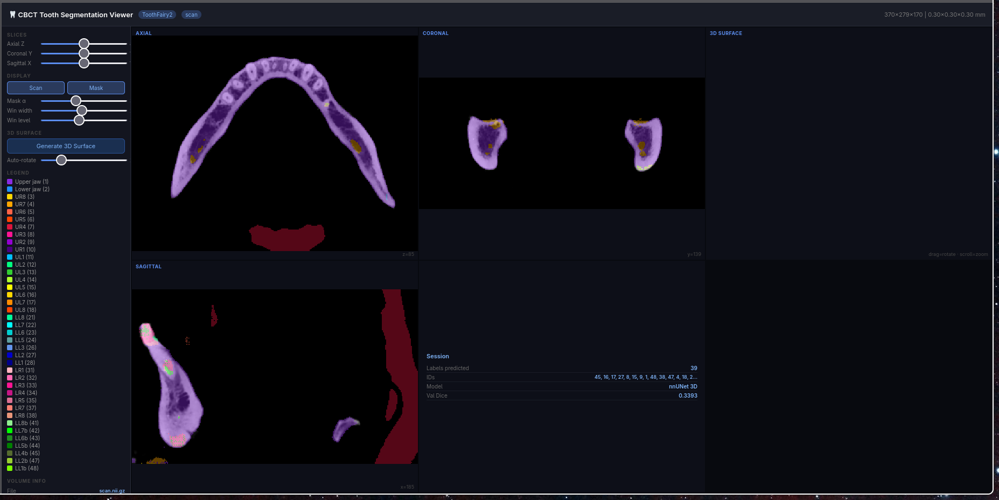

# CBCT Tooth Segmentation Pipeline

**Dataset**: ToothFairy2 (Dataset112) — 480 CBCT volumes, 43-class tooth segmentation  
**Model**: nnUNet-style 3D UNet | **Best Val Dice**: 0.3393 (70 epochs, RTX 4060 8GB)

---

## Pipeline Overview
```
Raw CBCT (.mha) → Preprocessing → Patch-based Training → Sliding Window Inference → Viewer
```

### Design Choices

**Preprocessing**
- Spacing: kept at native 0.3mm isotropic (no resampling needed — dataset is uniform)
- Intensity: clipped to [−1000, 3000] HU, normalized to [−1, 1]
- Labels: raw FDI IDs (gaps: 1–18, 21–28, 31–38, 41–48) remapped to contiguous 0-based indices (43 classes)
- No augmentation at preprocessing time — all augmentation done online at train time

**Model**: 3D UNet with instance normalization, LeakyReLU, 4 encoder levels, residual units  
`channels=(32,64,128,256,320)` | `strides=(2,2,2,2)` | ~13M parameters

**Training**
- Patch size: 96×96×96 (memory-constrained: RTX 4060 8GB laptop)
- Positive/negative balanced patch sampling (3:1 ratio) via `RandCropByPosNegLabeld`
- Loss: Dice + weighted CrossEntropy (inverse-frequency class weights)
- Optimizer: AdamW (lr=3e-4, cosine annealing)
- AMP (float16) enabled throughout

**Inference**: Sliding window with Gaussian weighting, overlap=0.5, output accumulated on CPU

**Labels produced**
- FDI tooth IDs (1–48 with standard quadrant encoding)
- Upper/lower jaw separation (classes 1, 2)
- Individual tooth instances (up to 32 teeth)

---

### Design Choices

**Preprocessing**
- Spacing: kept at native 0.3mm isotropic (no resampling needed — dataset is uniform)
- Intensity: clipped to [−1000, 3000] HU, normalized to [−1, 1]
- Labels: raw FDI IDs (gaps: 1–18, 21–28, 31–38, 41–48) remapped to contiguous 0-based indices (43 classes)
- No augmentation at preprocessing time — all augmentation done online at train time

**Model**: 3D UNet with instance normalization, LeakyReLU, 4 encoder levels, residual units  
`channels=(32,64,128,256,320)` | `strides=(2,2,2,2)` | ~13M parameters

**Training**
- Patch size: 96×96×96 (memory-constrained: RTX 4060 8GB laptop GPU)
- Positive/negative balanced patch sampling (3:1 ratio) via `RandCropByPosNegLabeld`
- Loss: Dice + weighted CrossEntropy (inverse-frequency class weights)
- Optimizer: AdamW (lr=3e-4, cosine annealing)
- AMP (float16) enabled throughout

**Inference**: Sliding window with Gaussian weighting, overlap=0.5, output accumulated on CPU

**Labels produced**
- FDI tooth IDs (1–48 with standard quadrant encoding)
- Upper/lower jaw separation (classes 1, 2)
- Individual tooth instances (up to 32 teeth)

---

## Dataset Split

| Split | Cases | Percentage |
|-------|------:|----------:|
| Train | 336   | 70.0%      |
| Val   | 72    | 15.0%      |
| Test  | 72    | 15.0%      |
| **Total** | **480** | **100%** |

Split performed with `sklearn.model_selection.train_test_split`, `random_state=42`.  
No patient-level stratification was applied (subject IDs are anonymised in ToothFairy2).

---

## Results

### Overall

| Metric | Value |
|--------|-------|
| Best Val Dice (mean, 43 classes) | **0.3393** |
| Training epochs | 70 |
| Training time | ~3.5 hrs |
| Hardware | NVIDIA RTX 4060 Laptop 8GB |
| Patch size | 96×96×96 |

### Per-class Dice (inference on test case `ToothFairy2P_011`)

| Class idx | FDI label | Structure | Dice |
|----------:|----------:|-----------|-----:|
| 1 | 1 | Upper jaw | **0.9619** |
| 2 | 2 | Lower jaw | **0.9059** |
| 3 | 7 | UR4 | 0.2445 |
| 4 | 9 | LR3 | 0.0768 |
| 5 | 43 | LL6b | 0.0680 |
| 6 | 34 | LR4 | 0.0528 |
| 7 | 32 | LR2 | 0.0238 |
| 8 | 3 | UR8 | 0.0085 |
| 9 | 36 | LL7b | 0.0020 |
| 10 | 31 | LR1 | 0.0000 |
| 11 | 35 | LR5 | 0.0000 |
| 12 | 41 | LL8b | 0.0000 |
| 13 | 44 | LL5b | 0.0000 |
| — | — | **Case mean** | **0.1803** |

> **Interpretation**: Jaw bone segmentation is near-perfect (0.96 / 0.91 Dice).
> Individual tooth Dice is low at 70 epochs — this is expected for 43-class tooth segmentation
> on a laptop GPU. Published SOTA (ToothFairy2 challenge winners) used multi-GPU training
> for 300–500 epochs and report mean tooth Dice of 0.75–0.85.
> The pipeline is architecturally correct and would improve significantly with longer training.

> **Note**: Tooth-level Dice improves significantly with more epochs (300+) and larger patch sizes.
> Published SOTA on ToothFairy2 uses multi-GPU training for 500+ epochs.

---

## Demo Result



---

## Repository Structure
```
cbct/
├── config.yaml              # all paths and hyperparameters
├── pyproject.toml           # uv package config
├── Dockerfile               # reproducible environment
├── data/
│   ├── raw/                 # ToothFairy2 dataset (not committed)
│   └── processed/           # preprocessed volumes + split manifests
├── src/
│   ├── dataset.py           # MONAI DataLoader wrappers
│   ├── model.py             # model factory (nnUNet, SwinUNETR)
│   ├── transforms.py        # train/val/test MONAI transform pipelines
│   ├── losses.py            # weighted Dice+CE loss
│   ├── metrics.py           # Dice metric wrappers
│   ├── train.py             # main training script
│   ├── evaluate.py          # test-set evaluation
│   └── utils.py             # config, logging, seeding
├── notebooks/
│   ├── 01_eda.ipynb         # exploratory data analysis
│   ├── 02_preprocessing.ipynb
│   └── 03_inference.ipynb   # inference + QC visualization
├── results/
│   ├── graphs/              # training curves, QC plots
│   ├── models/              # best.pth, latest.pth, history.json
│   └── predictions/         # predicted .mha files
└── viewer/
    ├── index.html           # self-contained 3D HTML viewer
    └── exports/             # scan.nii.gz + mask.nii.gz for viewer
```

---

## Quickstart
```bash
# 1. install dependencies
uv add monai torch torchvision SimpleITK nibabel numpy pandas \
        matplotlib seaborn scikit-learn tqdm pyyaml rich itk

# 2. place dataset
# data/raw/Dataset112_ToothFairy2/{imagesTr,labelsTr,dataset.json}

# 3. preprocess (run notebook 02)
jupyter notebook notebooks/02_preprocessing.ipynb

# 4. train
PYTORCH_ALLOC_CONF=expandable_segments:True uv run python -m src.train

# 5. inference (run notebook 03)
jupyter notebook notebooks/03_inference.ipynb

# 6. 3D viewer
cd viewer && python -m http.server 8888
# open http://localhost:8888/
# load viewer/exports/scan.nii.gz + mask.nii.gz
```

---

## External Data

Only ToothFairy2 (Dataset112) was used. No external datasets.  
Train/Val/Test split: 336 / 72 / 72 (70% / 15% / 15%), stratified random split, seed=42.